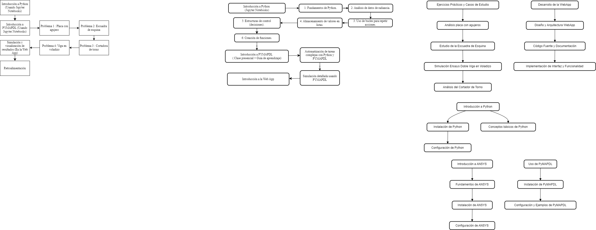
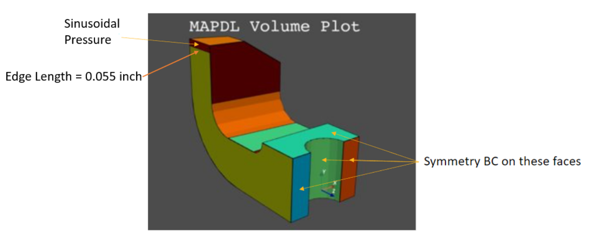
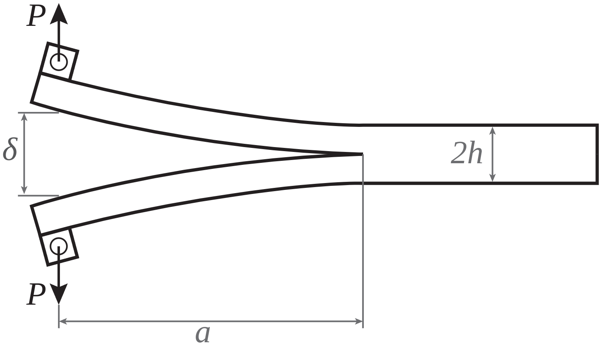
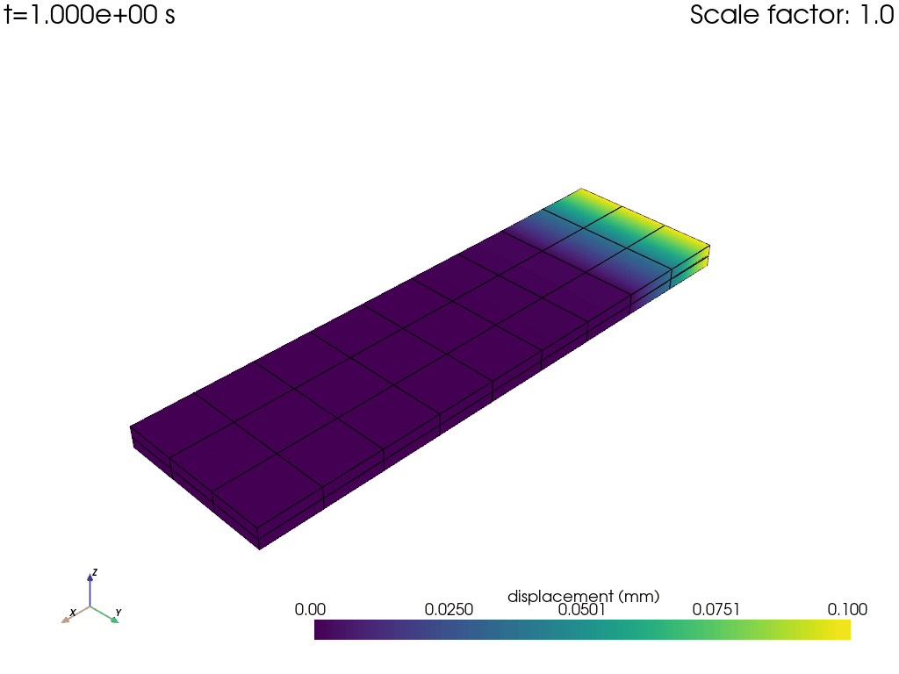

# SimuLab — Plataforma de Simulación y Análisis con PyMAPDL

<p align="center">
  
</p>

<p align="center">
  <a href="https://docs.pyansys.com/">
    
  </a>
  <a href="https://www.python.org/">
    
  </a>
  <a href="https://flask.palletsprojects.com/">
    
  </a>
  <a href="LICENSE">
    
  </a>
</p>

---

## Tabla de contenidos

- [¿Qué es SimuLab?](#-qué-es-simulab)
- [Origen y contexto académico](#-origen-y-contexto-académico)
- [Impacto y validación](#-impacto-y-validación)
- [Características](#-características)
- [Stack tecnológico](#-stack-tecnológico)
- [Instalación](#️-instalación)
- [Casos de estudio](#-casos-de-estudio)
  - [Caso 1: Placa con agujeros](#caso-1-placa-con-agujeros)
  - [Caso 2: Escuadra de esquina](#caso-2-escuadra-de-esquina)
  - [Caso 3: Cortador de torno](#caso-3-cortador-de-torno)
  - [Caso 4: Viga en voladizo — Delaminación](#caso-4-viga-en-voladizo--delaminación)
- [Web App](#-web-app)
- [Estructura del proyecto](#-estructura-del-proyecto)
- [Contribuciones](#-contribuciones)
- [Licencia](#-licencia)
- [Agradecimientos](#-agradecimientos)

---

## 🔩 ¿Qué es SimuLab?

**SimuLab** es una plataforma de análisis estructural por elementos finitos (FEA) que combina **ANSYS Mechanical APDL** con Python y una interfaz web en Flask. Permite configurar, ejecutar y visualizar simulaciones estructurales directamente desde el navegador, sin interactuar con la línea de comandos de ANSYS.

Fue diseñada para ingenieros mecánicos, investigadores y estudiantes que necesitan:

- Automatizar simulaciones FEA con parámetros variables (geometría, cargas, material).
- Integrar análisis estructural en flujos de trabajo Python.
- Explorar resultados de forma visual e interactiva desde un formulario web.

La idea central: traducir la potencia de ANSYS MAPDL a código Python reutilizable y versionable, compatible con pipelines de ingeniería y ciencia de datos.

---

## 📖 Origen y contexto académico

Este proyecto nació como **Trabajo de Grado** para optar al título de Ingeniero Mecánico en la **Escuela de Ingeniería Mecánica, Universidad Industrial de Santander (UIS)**, Bucaramanga, Colombia — presentado en **2024**.

La investigación exploró la integración de Python, PyMAPDL y Google Colab como objetos de aprendizaje para el curso de Análisis por Elementos Finitos en la UIS. Cuatro problemas de ingeniería estructural fueron implementados y entregados a través de una aplicación web, evaluada por estudiantes de tres cursos distintos.

Desde ese punto de partida académico, el proyecto creció hasta convertirse en una plataforma reutilizable de simulación, con una arquitectura modular, interfaz web completa y documentación de casos de uso.

**Autores del trabajo de grado:**
- Juan David Rodríguez Sánchez
- Iván Jesús Martínez Garcés — [@IvanGMtz](https://github.com/IvanGMtz)

**Director:** Dr. Octavio Andrés González Estrada — Doctor en Ingeniería Mecánica, UIS

**Documento público:** [Repositorio Noesis UIS — Trabajo de Grado](https://noesis.uis.edu.co/server/api/core/bitstreams/075818c4-eaba-424c-abd2-b24a13c78de4/content)

---

## 📊 Impacto y validación

La plataforma fue evaluada en tres cursos de la UIS durante 2024, con más de 60 estudiantes participantes:

| Métrica | Resultado |
|---|---|
| Satisfacción alta con la integración Python + ANSYS | **87.5%** |
| Aumento de interés en herramientas de programación para ingeniería | **93.1%** |
| Intención de matricular la electiva de Elementos Finitos tras la demostración | **91%** |

Cursos evaluados: *Diseño de Máquinas II*, *Dinámica*, y *Análisis por Elementos Finitos (electiva)*.

---

## ✨ Características

| Característica | Descripción |
|---|---|
| **Simulación paramétrica** | Define rangos de parámetros (cargas, geometría, material) y ejecuta múltiples análisis de forma automática |
| **Interfaz web interactiva** | Formularios en el navegador para configurar y lanzar simulaciones — sin escribir código |
| **Postprocesamiento automático** | Mapas de esfuerzo, deformación y curvas fuerza-desplazamiento generados al finalizar cada simulación |
| **API Python nativa** | Acceso programático completo a todos los parámetros del modelo via PyMAPDL |
| **Resultados exportables** | Gráficas y datos tabulares (Matplotlib / Pandas) |
| **Integración PyDPF** | Postprocesamiento de alto rendimiento con PyDPF para modelos de gran escala |

---

## 🛠 Stack tecnológico

| Capa | Herramienta |
|---|---|
| Interfaz al solver FEA | [PyMAPDL](https://mapdl.docs.pyansys.com/) — ANSYS Mechanical APDL vía Python |
| Postprocesamiento avanzado | [PyDPF](https://dpf.docs.pyansys.com/) — extracción de resultados de alto rendimiento |
| Backend web | [Flask](https://flask.palletsprojects.com/) — framework Python ligero |
| Frontend web | Bootstrap — UI responsiva |
| Cálculo numérico | [NumPy](https://numpy.org/) |
| Visualización | [Matplotlib](https://matplotlib.org/) |
| Manejo de datos | [Pandas](https://pandas.pydata.org/) |

---

## 🚀 Instalación

> **Requisito previo:** Se requiere una licencia activa de ANSYS Mechanical APDL instalada localmente o accesible en red.

```bash
# 1. Clonar el repositorio
git clone https://github.com/IvanGMtz/SimuLab--PyMAPDL-Simulation-Analytics-Platform.git
cd SimuLab--PyMAPDL-Simulation-Analytics-Platform

# 2. Crear y activar un entorno virtual (recomendado)
python -m venv venv
source venv/bin/activate          # Windows: venv\Scripts\activate

# 3. Instalar dependencias
pip install ansys-mapdl-core ansys-dpf-core flask numpy matplotlib pandas

# 4. Iniciar la aplicación
python app.py
```

La app queda disponible en **`http://localhost:5000`**.

---

## 🔬 Casos de estudio

Cuatro problemas clásicos de mecánica estructural implementados como objetos de aprendizaje paramétricos. Cada caso cubre definición de geometría, condiciones de frontera, mallado, resolución y visualización de resultados — completamente en Python vía PyMAPDL.

Cada caso está documentado como notebook de Jupyter exportado a PDF, con el flujo completo: definición del problema, implementación en PyMAPDL, postprocesamiento e interpretación de resultados.

---

### Caso 1: Placa con agujeros

**Problema:** Análisis estático lineal de una placa rectangular con múltiples agujeros circulares bajo carga axial. Evalúa la concentración de esfuerzos en los bordes de los agujeros — problema de referencia clásico en mecánica estructural.

| Parámetro | Valor |
|---|---|
| Dimensiones de la placa | 0.5 m × 0.25 m × 0.1 m |
| Agujeros | 3 circulares, radio = 0.05 m |
| Material | Acero — E = 2×10¹¹ Pa, ν = 0.27 |
| Carga aplicada | 1 000 Pa presión axial |
| Tipo de análisis | Estático lineal |
| Resultado | Distribución de esfuerzo de Von Mises |

<!-- PENDIENTE: agregar captura del mapa de Von Mises -->
<!-- Ruta sugerida: static/images/caso1_placa_von_mises.png -->

**Resultado clave:** Las concentraciones de esfuerzo se localizan en los bordes de los agujeros, evidenciando el comportamiento clásico del factor de concentración de esfuerzos en placas perforadas.

📄 [Notebook completo — Placa con agujeros](docs/simulab_caso_01_placa_con_agujeros.pdf)

---

### Caso 2: Escuadra de esquina

**Problema:** Análisis estático lineal de un soporte en forma de L con extremos semicirculares bajo carga distribuida no uniforme. Evalúa desplazamiento normalizado y esfuerzo de Von Mises en la geometría completa.

| Parámetro | Valor |
|---|---|
| Geometría | Forma en L: brazo horizontal 6×2 u, brazo vertical 2×3 u, extremos semicirculares r = 1 u |
| Material | Acero — E = 3×10⁷ psi, ν = 0.27 |
| Espesor | 0.5 u (elemento plano — `PLANE183`) |
| Condición de frontera superior | Agujero superior: fijo (todos los grados de libertad) |
| Carga aplicada | Presión distribuida en agujero inferior: 50–500 psi |
| Tipo de análisis | Estático lineal — tensión plana |
| Resultado | Desplazamiento normalizado (in) |

<p align="center">
  
</p>

**Resultado clave:** El desplazamiento se concentra en la zona del agujero cargado, con el brazo del soporte como camino principal de transferencia de carga entre la zona fija y la cargada.

📄 [Notebook completo — Escuadra de esquina](docs/simulab_caso_02_escuadra_de_esquina.pdf)

---

### Caso 3: Cortador de torno

**Problema:** Análisis de esfuerzos en un cortador de torno bajo carga de presión sinusoidal. Se construye un sistema de coordenadas local en PyMAPDL para aplicar una carga espacialmente variable, replicando condiciones reales de corte. Utiliza la geometría de ejemplo integrada en ANSYS.

| Parámetro | Valor |
|---|---|
| Geometría | ANSYS built-in — `LatheCutter.anf` |
| Material | E = 1.0×10⁷ psi, ν = 0.27 |
| Carga aplicada | 10 000 psi — presión sinusoidal vía SC local (ID 11) |
| Condiciones de simetría | 4 caras de simetría (áreas 9, 10, 11, 16) |
| Tipo de elemento | SOLID285, smart size 4 |
| Tipo de análisis | Estático no lineal (`NLGEOM ON`) |
| Resultado | Esfuerzo principal 1 (psi) — modelo completo y sección XY |

<p align="center">
  
</p>

<p align="center">
  
</p>

**Resultado clave:** El esfuerzo principal máximo se concentra en la sección interna y la base del cortador — zonas críticas para la falla de la herramienta bajo cargas reales de mecanizado.

📄 [Notebook completo — Cortador de torno](docs/simulab_caso_03_cortador_de_torno.pdf)

---

### Caso 4: Viga en voladizo — Delaminación

**Problema:** Análisis estático no lineal de una viga de doble voladizo (DCB — Double Cantilever Beam) para simular delaminación en placas compuestas mediante elementos cohesivos. Modela la propagación de una grieta entre dos capas de material compuesto bajo desplazamiento controlado — caso avanzado de mecánica de fractura.

| Parámetro | Valor |
|---|---|
| Dimensiones | Longitud 75 mm + 10 mm de precorte, ancho 25 mm, altura 1.7 mm por placa |
| Desplazamiento aplicado | 10 mm en el extremo superior, −10 mm en el inferior |
| Material (placas) | Compuesto — E = 61 340 MPa, ν = 0.1, ρ = 1.42×10⁻⁹ t/mm³ |
| Modelo cohesivo | Bilineal (CZM) — σ_max = 50 MPa, δ_max = 0.5 mm |
| Elementos especiales | SOLID185 (sólidos), TARGE170 + CONTA174 (zona cohesiva) |
| Sub-pasos | 100 incrementos de carga (NSUBST) |
| Tipo de análisis | Estático no lineal |
| Resultado | Curva fuerza-desplazamiento (Matplotlib) |

<p align="center">
  
</p>

<p align="center">
  
</p>

**Resultado clave:** La curva fuerza-desplazamiento captura el pico de iniciación de grieta seguido de propagación estable — consistente con la teoría de mecánica de fractura en modo I para materiales compuestos.

📄 [Notebook completo — Viga en voladizo, delaminación](docs/simulab_caso_04_viga_en_voladizo_delaminacion.pdf)

---

## 🌐 Web App

La plataforma expone los cuatro casos de estudio a través de una interfaz Flask + Bootstrap. El usuario modifica los parámetros de entrada en formularios HTML y lanza las simulaciones directamente desde el navegador.

**Flujo de trabajo:**

1. El usuario completa un formulario con los parámetros de simulación (geometría, material, cargas).
2. Los datos se envían por `POST` al backend Flask.
3. Python + PyMAPDL ejecutan el análisis ANSYS correspondiente.
4. Los resultados (gráficas, mapas de deformación, curvas) se renderizan y retornan al navegador.

**Rutas disponibles:**

| Ruta | Caso de estudio |
|---|---|
| `/` | Página principal |
| `/escuadra` | Caso 2 — Escuadra de esquina |
| `/cortador_de_torno` | Caso 3 — Cortador de torno |
| `/dobleviga` | Caso 4 — Viga en voladizo |

<!-- PENDIENTE: agregar captura de la interfaz web -->
<!-- Ruta sugerida: static/images/webapp_interfaz.png -->

---

## 📁 Estructura del proyecto

```
SimuLab--PyMAPDL-Simulation-Analytics-Platform/
├── app.py                                              # Punto de entrada Flask
├── AGENTS.md                                           # Instrucciones para agentes de IA
├── LICENSE                                             # Licencia MIT
├── README.md
├── docs/
│   ├── simulab_caso_01_placa_con_agujeros.pdf          # Notebook — Caso 1
│   ├── simulab_caso_02_escuadra_de_esquina.pdf         # Notebook — Caso 2
│   ├── simulab_caso_03_cortador_de_torno.pdf           # Notebook — Caso 3
│   └── simulab_caso_04_viga_en_voladizo_delaminacion.pdf  # Notebook — Caso 4
├── lib/
│   └── pymapdl/
│       ├── cortador_de_torno.py                        # Análisis Caso 3
│       ├── soporte.py                                  # Análisis Caso 2
│       └── viga_doble_voladizo.py                      # Análisis Caso 4
├── static/
│   ├── css/
│   │   └── bootstrap.min.css
│   ├── images/
│   │   ├── Areas_Soporte.png
│   │   ├── Bracket.png
│   │   ├── Cortador de torno.png
│   │   ├── Doble viga  voladizo.png
│   │   ├── PyAnsys.jpeg
│   │   ├── PyMAPDL.drawio.png
│   │   ├── PyMAPDL.png
│   │   ├── Soporte de Esquina.png
│   │   ├── double_cantilever.png
│   │   ├── lathe_cutter_model.png
│   │   └── sphx_glr_composite_dcb_006.gif
│   └── js/
│       └── bootstrap.bundle.min.js
└── templates/
    ├── cortador.html                                   # Template Caso 3
    ├── dobleviga.html                                  # Template Caso 4
    ├── escuadra.html                                   # Template Caso 2
    └── index.html                                      # Página principal
```

---

## 🤝 Contribuciones

Las contribuciones son bienvenidas. Para contribuir:

1. Haz un fork del repositorio.
2. Crea una rama de funcionalidad: `git checkout -b feature/nombre-de-la-funcionalidad`
3. Registra tus cambios: `git commit -m 'feat: descripción del cambio'`
4. Abre un Pull Request describiendo qué cambiaste y por qué.

Para reportar errores o proponer ideas, abre un [Issue](https://github.com/IvanGMtz/SimuLab--PyMAPDL-Simulation-Analytics-Platform/issues).

---

## 📄 Licencia

Distribuido bajo la **Licencia MIT**. Ver [LICENSE](LICENSE) para más detalles.

---

## 🙏 Agradecimientos

- [ANSYS / PyAnsys](https://docs.pyansys.com/) por abrir el ecosistema de simulación de alta fidelidad a Python.
- **Dr. Octavio Andrés González Estrada** (UIS) por la dirección académica del trabajo de grado.
- **Juan David Rodríguez Sánchez** por la coautoría del trabajo de grado original.
- La comunidad de ingeniería computacional de código abierto.

---

<div align="center">
  <sub>Construido por ingenieros, para ingenieros · Universidad Industrial de Santander, 2024</sub>
</div>
